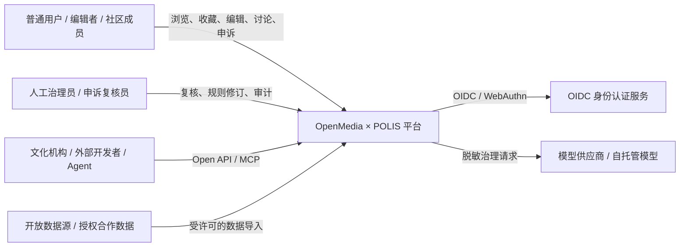
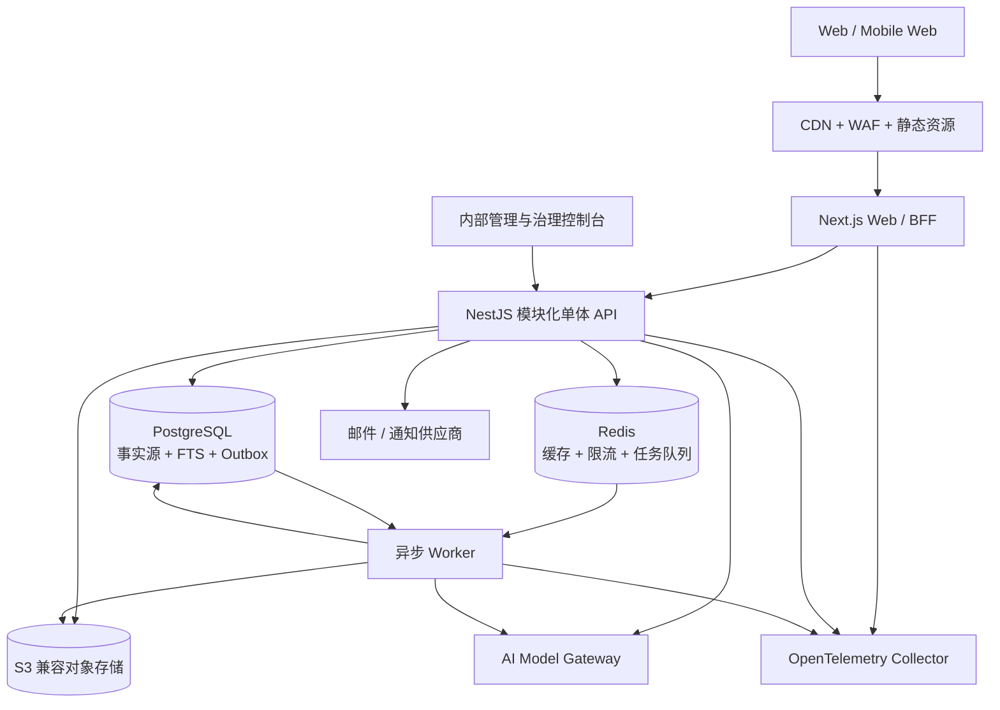
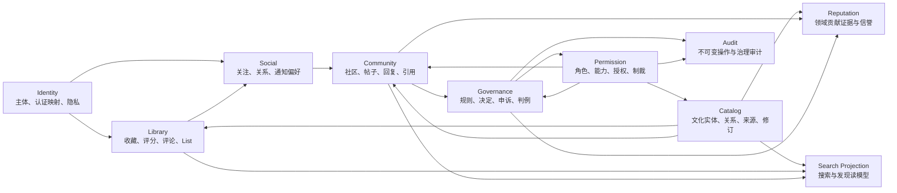
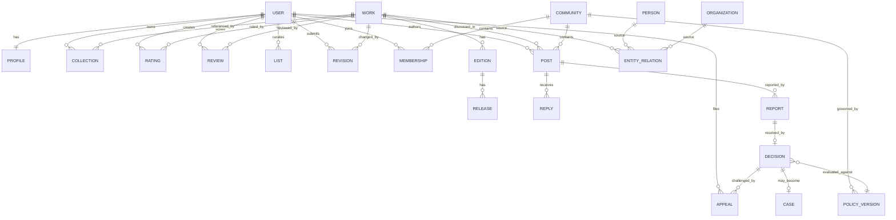
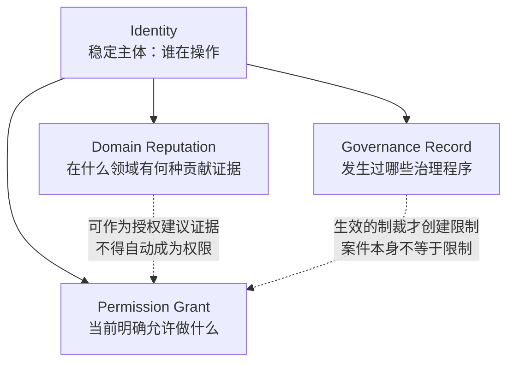
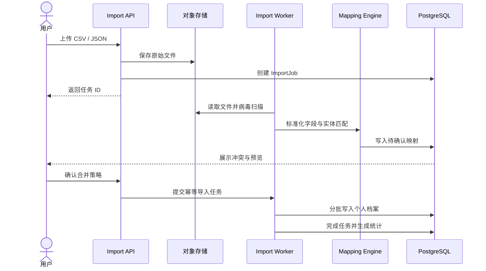
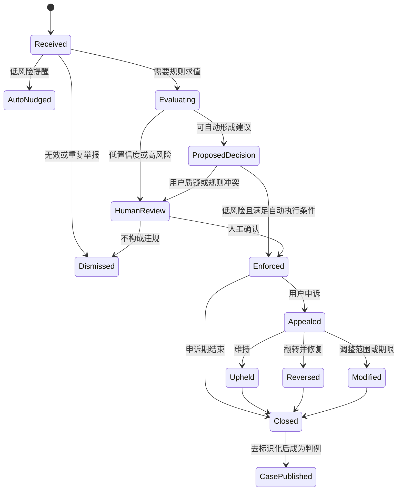
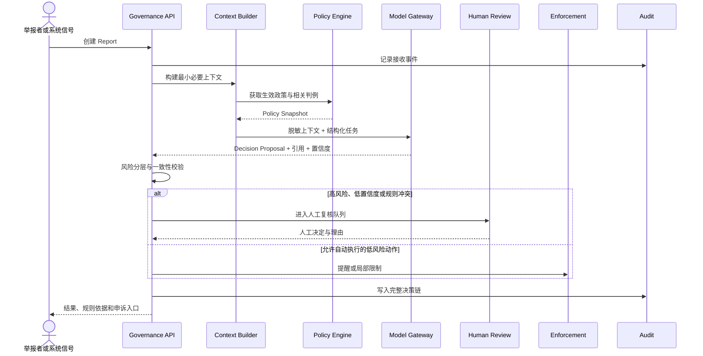
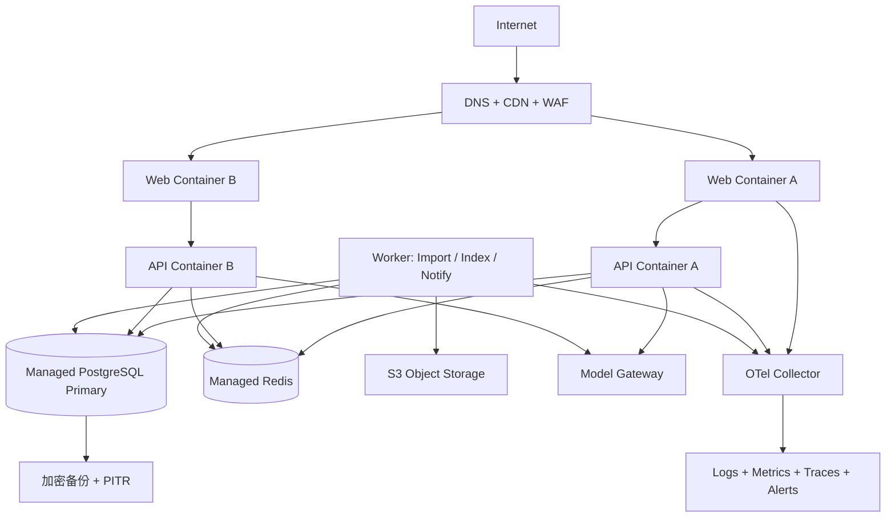
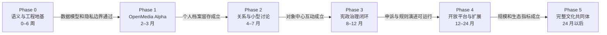

# OpenMedia × POLIS 整体技术架构设计书

> 文档版本：1.0  
> 状态：可用于技术评审与 MVP 立项  
> 对应产品企划：OpenMedia × POLIS 联合项目落地企划书 v1.0  
> 核心定义：以开放文化知识图谱为基础、以个人文化档案为入口、由 AI 宪政系统治理的公共文化社区。

---

## 目录

1. [文档目标与范围](#1-文档目标与范围)
2. [业务目标与架构原则](#2-业务目标与架构原则)
3. [总体技术架构](#3-总体技术架构)
4. [领域划分与模块职责](#4-领域划分与模块职责)
5. [关键数据模型](#5-关键数据模型)
6. [统一身份、领域信誉、权限与治理记录](#6-统一身份领域信誉权限与治理记录)
7. [OpenMedia 文化知识与个人档案架构](#7-openmedia-文化知识与个人档案架构)
8. [POLIS 社区与 AI 宪政治理架构](#8-polis-社区与-ai-宪政治理架构)
9. [搜索、推荐与人类判断图谱](#9-搜索推荐与人类判断图谱)
10. [API、事件与集成架构](#10-api事件与集成架构)
11. [安全、隐私与合规架构](#11-安全隐私与合规架构)
12. [部署、运维与可观测性](#12-部署运维与可观测性)
13. [性能、容量与可靠性设计](#13-性能容量与可靠性设计)
14. [测试与质量保障](#14-测试与质量保障)
15. [从 MVP 到完全体的架构演进](#15-从-mvp-到完全体的架构演进)
16. [工程落地流程](#16-工程落地流程)
17. [团队配置与职责](#17-团队配置与职责)
18. [关键架构决策记录](#18-关键架构决策记录)
19. [风险、触发器与降级预案](#19-风险触发器与降级预案)
20. [完成标准与首批交付清单](#20-完成标准与首批交付清单)

---

## 1. 文档目标与范围

### 1.1 文档目标

本设计书将产品企划中的愿景转换成可执行的技术方案，回答以下问题：

- OpenMedia 与 POLIS 如何作为同一平台的两个领域协同，而不互相吞噬；
- 如何共用统一 Identity，同时严格区分 Reputation、Permission 与 Governance Record；
- 如何从文化作品、版本、人物和主题建立开放知识图谱；
- 如何把个人评分、收藏、评论和 List 建设成用户可拥有、可迁移的文化档案；
- 如何将平台宪法、社区章程、AI 沟通人格、判例、申诉和审计连接成可靠治理链路；
- 如何在小团队可承担的 MVP 架构上起步，并平滑演进到完整平台；
- 如何进行研发、测试、灰度、上线、运营和架构升级。

### 1.2 范围内

- Web 与移动 Web 产品；
- 统一身份、账号安全和隐私设置；
- 电影领域首发的作品、版本、人物、组织和关系模型；
- 搜索、评分、收藏、评论、List、关注、Wiki 和 Revision；
- 对象中心的社区、帖子、回复、引用、举报、申诉和屏蔽；
- AI 辅助治理、规则版本、决策记录、人工复核和审计；
- 领域信誉、显式权限和局部/全局制裁；
- 数据导入导出、开放 API 与后续 MCP；
- 部署、监控、测试、安全、灾备和演进计划。

### 1.3 MVP 范围外

- 原生 iOS / Android 客户端；
- 一次性覆盖图书、音乐、游戏、播客等全部文化品类；
- 全站实时热搜与无限信息流；
- 基于单一全局用户分数的排序或权限；
- 完全自动化的高风险处罚；
- 多模型议会、代币经济、广告竞价系统；
- 为了“图谱”概念而过早引入图数据库；
- 为了“扩展性”而在 MVP 阶段拆分大量微服务。

### 1.4 架构假设

- 首发垂类为电影；
- MVP 注册用户规模不超过 1 万，首年目标不超过 5 万；
- 作品基础数据约 5–10 万条，后续扩展到百万级文化实体；
- 团队初期 3–6 人，必须降低部署和跨语言维护成本；
- AI 只处理低风险提醒和辅助判断，高风险决定有人类责任主体；
- 首发为中心化服务，但数据模型和 API 保留未来开放与联邦化可能；
- 默认不把用户私密档案用于公共推荐、广告画像或治理判断。

---

## 2. 业务目标与架构原则

### 2.1 业务分层

| 层级 | 产品职责 | 用户价值 | 技术重点 |
|---|---|---|---|
| 文化知识层 | Work、Edition、Release、Person、Organization、Topic、Relation | 找到可信、结构化的文化信息 | 实体建模、版本关系、来源、修订、搜索 |
| 个人档案层 | Rating、Collection、Review、List、Tag、Import/Export | 建立个人可拥有的文化世界 | 隐私、数据可迁移、低延迟写入、长期保存 |
| 社区交流层 | Community、Post、Reply、Quote、Follow、Report | 围绕对象发现人并展开讨论 | 对象上下文、关系图、通知、反滥用 |
| 宪政治理层 | Constitution、Charter、Soul、Decision、Appeal、Case、Audit | 获得透明、可申诉的公共秩序 | 规则编译、风险分层、AI 网关、审计链 |
| 开放生态层 | Open API、MCP、机构数据合作 | 让文化数据和公共判断被外部应用调用 | 配额、授权、数据许可、稳定版本 |

### 2.2 八项强制架构原则

1. **OpenMedia 是主宇宙**：默认首页、导航、通知和数据指标优先服务文化知识与个人档案，POLIS 是主动进入的公共空间。
2. **对象中心而非热度中心**：社区讨论必须关联 Work、Person、Topic、List 或明确主题，避免脱离语义上下文的全站争议流。
3. **身份与评价分离**：Identity 是稳定主体键，不承担信誉、权限或处罚语义。
4. **领域信誉而非全局信誉**：信誉只在领域和能力维度内生效，不产生跨全站的神秘 TrustScore。
5. **权限必须显式**：权限来源、范围、期限、授予者和撤销方式均可查询，不由推荐分或处罚记录隐式推导。
6. **治理记录可审计但不公开羞辱**：治理记录服务申诉、审计和规则优化，不自动形成公开黑名单。
7. **AI 服从程序**：模型必须读取指定规则版本、输出结构化理由、接受申诉，并在低置信度和高风险时停止自动执行。
8. **先模块化单体，后按证据拆分**：只有容量、组织边界或故障隔离指标达到触发条件时才提取服务。

### 2.3 非功能目标

| 维度 | MVP 目标 | 成长期目标 |
|---|---|---|
| 可用性 | 月度 99.5% | 核心读取 99.9%，写入与治理 99.9% |
| 页面性能 | 核心作品页 LCP P75 < 2.5 秒 | 全球/跨地域 P75 < 2 秒 |
| API 延迟 | 常规读取 P95 < 500 ms | 常规读取 P95 < 300 ms |
| 数据一致性 | 账号、收藏、处罚强一致；搜索最终一致 | 同左，事件延迟 P95 < 5 秒 |
| 恢复能力 | RPO ≤ 24 小时，RTO ≤ 4 小时 | RPO ≤ 5 分钟，RTO ≤ 1 小时 |
| 审计完整性 | 所有强制治理动作 100% 记录 | 同左并具备独立校验与归档 |
| 可移植性 | 用户可导出个人核心数据 | 数据、关注关系和公开贡献可完整迁移 |

---

## 3. 总体技术架构

### 3.1 系统上下文



### 3.2 MVP 容器架构



### 3.3 MVP 技术选型

| 区域 | 推荐方案 | 选型理由 | 替换边界 |
|---|---|---|---|
| 前端 | TypeScript + Next.js | 作品页需要 SSR/SEO；同一工程支持用户端、服务端渲染和 BFF | 通过 OpenAPI 客户端隔离后端 |
| UI | CSS Modules 或项目级 Token + 无障碍组件基础层 | 保持 OpenMedia 与 POLIS 两种视觉语义，共享交互规范 | 不绑定单一大型 UI 套件 |
| 后端 | TypeScript + NestJS 模块化单体 | 小团队统一语言；领域模块、依赖注入、校验与任务处理成熟 | 领域边界通过接口和事件隔离，可单独提取 |
| 数据访问 | PostgreSQL 原生迁移 + 类型安全查询层 | 需要复杂关系、部分索引、JSONB、事务和精细 SQL 控制 | 禁止把 ORM 实体直接暴露为领域模型 |
| 主数据库 | PostgreSQL | 事务、关系、JSONB、全文检索、审计和成熟运维能力 | 始终保持核心事实源地位 |
| 缓存/队列 | Redis + BullMQ | MVP 成本低，适合缓存、限流和异步任务 | 领域事件量达到阈值后换消息总线 |
| 搜索 | PostgreSQL FTS + trigram + 应用层中文分词 | 避免过早维护独立搜索集群 | 搜索量与召回需求达到阈值后引入 OpenSearch |
| 对象存储 | S3 兼容存储 | 存放图片、导入包、导出包和归档，不把大文件塞入数据库 | 通过统一 Storage Adapter 避免厂商锁定 |
| 身份认证 | 标准 OIDC Provider + WebAuthn/Passkey 能力 | 认证协议标准化；应用保留自己的 Identity 与 Profile | 可以在托管与自建 IdP 之间迁移 |
| AI | 内部 Model Gateway + 结构化输出 | 统一路由、预算、审计、脱敏、降级与供应商切换 | 业务模块不得直接调用模型 SDK |
| 可观测性 | OpenTelemetry + 指标/日志/追踪后端 | 跨 Web、API、Worker 与模型调用统一关联 | 采集标准不随监控供应商改变 |
| 代码组织 | pnpm Monorepo | 共享类型、Schema、SDK、UI Token 和测试工具 | 禁止领域模块互相读取内部表 |

### 3.4 推荐代码库结构

```text
openmedia-polis/
├─ apps/
│  ├─ web/                    # 用户端 Web、SSR、BFF
│  ├─ api/                    # 模块化单体 HTTP API
│  ├─ worker/                 # 导入、索引、通知、AI 与导出任务
│  └─ admin/                  # 内部数据与治理控制台
├─ packages/
│  ├─ contracts/             # OpenAPI Schema、事件 Schema、错误码
│  ├─ design-system/         # Token、基础组件、可访问性规范
│  ├─ observability/         # 日志、指标、Trace 封装
│  ├─ policy-engine/         # 规则 AST、编译、冲突检查、测试
│  ├─ model-gateway/         # 模型适配器与结构化输出
│  └─ test-kit/              # 数据工厂、容器测试与公共断言
├─ domains/
│  ├─ identity/
│  ├─ catalog/
│  ├─ library/
│  ├─ social/
│  ├─ community/
│  ├─ governance/
│  ├─ reputation/
│  ├─ permission/
│  ├─ audit/
│  └─ integration/
├─ database/
│  ├─ migrations/
│  ├─ seeds/
│  └─ maintenance/
├─ docs/
│  ├─ architecture/
│  ├─ adr/
│  ├─ api/
│  └─ runbooks/
└─ infra/
   ├─ local/
   ├─ environments/
   └─ dashboards/
```

> `domains/` 可以实际位于 `apps/api/src/domains/`。上面的独立展示用于强调领域边界，不代表 MVP 必须创建多个可发布包。

---

## 4. 领域划分与模块职责

### 4.1 限界上下文



### 4.2 模块职责表

| 模块 | 拥有的数据 | 对外能力 | 不应承担的职责 |
|---|---|---|---|
| Identity | User、Identity、Profile、CredentialRef、PrivacySetting | 当前主体、账号状态、公开资料、隐私选择 | 不计算信誉，不直接决定社区权限 |
| Catalog | Work、Edition、Release、Person、Organization、Topic、Relation、Source、Revision | 查询实体、提交修订、合并与回滚 | 不保存用户收藏，不处理社区处罚 |
| Library | Rating、Collection、Review、List、ListItem、UserTag | 记录、整理、导入导出个人档案 | 不承担公共讨论排序 |
| Social | Follow、Block、Mute、NotificationPreference | 关系、屏蔽、静音、通知订阅 | 不拥有帖子内容 |
| Community | Community、Membership、Post、Reply、Quote、Vote、Report | 发帖、回复、引用、举报、社区浏览 | 不自行修改处罚和信誉 |
| Governance | PolicyDocument、PolicyVersion、Decision、Appeal、Case、ReviewQueue | 规则求值、决定、申诉、复核、判例 | 不直接修改个人档案，不拥有认证信息 |
| Reputation | ReputationDomain、Dimension、Evidence、Aggregate | 查询领域信誉、贡献证据、内部排序信号 | 不直接授予权限，不公开全局总分 |
| Permission | Role、Capability、Grant、Restriction、Sanction | `can(subject, action, resource, context)` | 不存储完整治理案件内容 |
| Audit | AuditEvent、IntegrityCheckpoint、Archive | 检索操作链、完整性校验、归档 | 不成为业务查询主库 |
| Integration | ImportJob、ExportJob、Webhook、ApiClient、Quota | 数据交换、开放 API、MCP | 不绕过领域服务直接写表 |

### 4.3 模块通信规则

- 同步写操作必须通过目标领域的 Application Service；
- 任何模块不得跨 Schema 直接更新其他模块的表；
- 跨模块读取优先使用公开 Query Service，复杂页面可使用专用只读投影；
- 跨领域副作用通过 Outbox 事件完成，例如 `CollectionAdded` 触发统计投影，而不是在收藏事务中同步刷新所有页面；
- 领域事件只描述已经发生的事实，不携带“请执行某动作”的命令语义；
- 事件消费者必须幂等，并保存处理游标或去重键；
- 所有公开事件具有版本号，破坏性变化创建新版本。

---

## 5. 关键数据模型

### 5.1 数据库 Schema 划分

MVP 使用一个 PostgreSQL 集群、一个主业务数据库，按 Schema 隔离所有权：

```text
identity.*       catalog.*        library.*
social.*         community.*      governance.*
reputation.*     permission.*     audit.*
integration.*    projection.*     platform.*
```

Schema 隔离不是安全边界的全部，但它可以：

- 明确表的业务所有者；
- 限制迁移脚本和数据库账号权限；
- 防止 ORM 自动关联把边界打穿；
- 为未来服务提取提供清晰的数据搬迁单元。

### 5.2 核心实体关系



### 5.3 文化实体模型

#### Work、Edition、Release

- **Work**：抽象作品，例如一部电影本身；
- **Edition**：具有内容或编排差异的版本，例如导演剪辑版、修复版；
- **Release**：某地区、载体、平台或时间的具体发行实例；
- **ExternalIdentifier**：IMDb、ISAN、ISBN 等外部标识，独立建模，支持一个实体多个标识；
- **LocalizedText**：标题、别名、简介等多语言内容；
- **SourceAssertion**：某个字段或关系由什么来源支持；
- **EntityRelation**：实体之间带类型、时间、角色和来源的关系。

#### 为什么不用一个 `media_item` 大表

一个扁平表会把作品、版本和发行信息混在一起，导致：

- 不同剪辑版评分被错误合并；
- 地区上映日期互相覆盖；
- 条码、流媒体上线和作品本体缺乏清晰归属；
- 后续扩展图书和音乐时出现大量空字段。

因此使用稳定的文化实体内核，并为不同品类增加扩展表：

```text
catalog.work
catalog.edition
catalog.release
catalog.work_film_detail
catalog.person
catalog.organization
catalog.topic
catalog.entity_relation
catalog.external_identifier
catalog.localized_text
catalog.source
catalog.source_assertion
```

### 5.4 修订与来源模型

Wiki 不直接覆盖当前实体，而是采用“修订请求 + 已发布快照”：

1. 用户提交 Revision，包含基础版本、字段 Patch、来源和编辑说明；
2. 系统执行 Schema 校验、重复检测和权限检查；
3. 低风险修订可自动合并，高风险修订进入复核；
4. 合并后生成新的 EntitySnapshot；
5. 发布 `CatalogEntityRevised` 事件，刷新搜索和缓存；
6. 回滚创建新的逆向 Revision，不物理删除历史。

必须保存：

- `base_version`：用户编辑时看到的版本；
- `patch`：结构化字段差异；
- `source_assertions`：变更依据；
- `review_state`：待审核、已合并、已拒绝、已撤销；
- `reviewer_id` 与原因；
- `published_version`：合并后的实体版本。

### 5.5 ID 与时间规范

- 内部主键使用可排序、非连续暴露的全局唯一 ID；
- 对外 URL 使用稳定 Slug + ID，不以标题作为唯一键；
- 所有数据库时间使用 UTC，显示时转换为用户时区；
- 所有写模型包含 `created_at`、`updated_at` 和必要的 `version`；
- 需要乐观锁的实体使用 `version` 或 ETag；
- 删除默认采用状态机或软删除；审计和治理表禁止业务物理删除；
- PII 与业务主体 ID 分离，降低导出、匿名化和删除难度。

---

## 6. 统一身份、领域信誉、权限与治理记录

### 6.1 四套记录的关系



### 6.2 Identity

Identity 负责：

- 外部认证主体与内部 User ID 映射；
- 邮箱、Passkey、恢复方式和登录会话；
- 公开 Profile 与私密 PII 的隔离；
- 账号状态：正常、待验证、受保护、停用、全局安全冻结；
- 用户隐私同意、数据用途偏好和导出状态。

Identity 不包含：

- “优质用户”“危险用户”等价值标签；
- Wiki 编辑等级；
- 社区讨论信誉；
- 某次处罚的完整理由；
- 任何全局社会信用分。

### 6.3 Domain Reputation

信誉聚合键至少包含：

```text
(subject_id, domain_type, domain_id, dimension)
```

示例：

```text
(user_123, "catalog", "film", "edit_accuracy")
(user_123, "community", "film-history", "constructive_participation")
(user_123, "governance", "film-history", "review_quality")
```

信誉由不可变 Evidence 聚合，不直接在业务流程里随意加减分：

| Evidence | 可能影响 | 不应影响 |
|---|---|---|
| 修订被合并且长期未回滚 | 对应品类的编辑准确度 | 其他品类知识信誉 |
| 引用被多个高质量讨论采用 | 对应主题的讨论贡献 | 登录或导出权限 |
| 治理复核与后续申诉结果一致 | 对应社区的复核质量 | 个人收藏访问 |
| 一次社区跑题处罚 | 当地讨论行为观察 | Wiki 编辑准确度 |

对外优先展示可理解的档位和贡献事实，例如“稳定贡献者”“新进入者”，而不是暴露精确内部数字。

### 6.4 Permission

权限模型采用 RBAC + ABAC：

- RBAC 表达常见角色：普通成员、编辑者、社区治理员、申诉复核员；
- ABAC 表达范围和条件：只在电影领域、只在指定社区、只允许低风险合并、授权在某日到期；
- 显式 Grant 记录授权来源和期限；
- Restriction 记录生效限制；
- 所有权限检查统一调用 Policy Enforcement Point，不在 Controller 中散落条件判断。

权限请求的标准上下文：

```json
{
  "subject": "user_123",
  "action": "catalog.revision.merge",
  "resource": { "type": "work", "id": "work_456", "domain": "film" },
  "context": { "risk": "low", "community": null, "time": "UTC timestamp" }
}
```

### 6.5 Governance Record

Governance Record 保存：

- 案件、举报、证据和上下文引用；
- 当时生效的规则快照；
- AI 建议、模型与提示模板版本；
- 人工决定、执行动作和通知；
- 申诉、复核、翻转与修复；
- 审计事件和完整性校验。

它不直接参与公开排名。只有一个**已生效、仍在有效期内的 Sanction**可以在 Permission 领域创建 Restriction；案件结束或申诉翻转后，Restriction 必须自动撤销或修正。

---

## 7. OpenMedia 文化知识与个人档案架构

### 7.1 核心读取路径

作品详情页是主流量入口，读取路径按以下顺序优化：

1. CDN 命中公开作品页静态或增量缓存；
2. Web BFF 获取作品快照、版本摘要、评分聚合和用户个性状态；
3. 公开数据可以较长缓存，用户收藏状态使用短缓存或直接读取；
4. 评论和相关讨论分页加载，不阻塞作品首屏；
5. 搜索索引和推荐投影是可重建读模型，不作为事实源；
6. 写入成功后立即返回事实结果，缓存失效和搜索更新异步完成。

### 7.2 个人档案写入

评分、收藏和标签具有高频、低复杂度特点：

- 使用唯一约束保证一个用户对一个目标只有一个当前 Rating/Collection；
- 更新使用 Upsert，但写入前保留必要的历史事件；
- 私密性字段与内容一起事务提交，避免短暂公开；
- 聚合评分由事件异步刷新，不在主事务锁全局计数；
- 用户看到的自己的写入使用 Read-Your-Writes 路径；
- 公共聚合允许秒级最终一致。

### 7.3 导入流程



导入必须具备：

- 文件大小、行数和压缩炸弹限制；
- MIME 与实际内容双重校验；
- 幂等键，重复提交不会重复写入；
- Dry Run 预览；
- 实体匹配置信度与人工确认；
- 分批事务，失败可从检查点继续；
- 完整错误报告，不因单行错误丢弃整个文件；
- 原始文件按保留策略自动删除。

### 7.4 导出与数据可迁移

导出包括：

- Profile 与隐私设置；
- Rating、Collection、Review、List、Tag；
- 用户公开修订与贡献引用；
- Follow/Block/Mute 的可迁移表示；
- 用户发起的帖子、回复和治理申诉；
- 机器可读 JSON + 人类可读 HTML/CSV；
- 导出 Schema 版本和字段说明。

导出任务必须异步执行、使用短期签名 URL、下载一次后可主动失效，并留下安全审计记录。

### 7.5 防止 POLIS 吞噬 OpenMedia 的技术约束

- 首页 Query 不读取全站争议热度表；
- 通知聚合器对连续回复合并、限频并支持静音；
- `TrendingDiscussion` 不进入全局导航，只能在对应对象或社区上下文出现；
- 作品页核心元数据、收藏与导出在 Community 服务降级时仍可用；
- 推荐目标函数不使用原始回复次数或情绪强度作为正向信号；
- 数据仪表盘把“档案留存、知识覆盖、修订质量”置于 DAU 之前；
- 社区数据库逻辑故障不得阻断用户读取私人档案。

---

## 8. POLIS 社区与 AI 宪政治理架构

### 8.1 三层政策模型

| 政策层 | 作用范围 | 可定义内容 | 不可定义内容 |
|---|---|---|---|
| Constitution | 全平台 | 基本权利、安全底线、正当程序、全局制裁条件 | 具体社区审美与表达偏好 |
| Charter | 单个社区 | 讨论范围、证据要求、跑题容忍度、当地流程 | 违反平台基本权利、扩大到其他社区 |
| Soul | AI 沟通界面 | 语气、解释风格、称呼、提醒方式 | 新增处罚、改变证据门槛、覆盖规则 |

政策采用“人类可读 Markdown + 机器可执行结构”的双表示：

```text
policy_document
├─ content_markdown       # 用户与治理员阅读
├─ compiled_ast_json      # 规则引擎执行
├─ schema_version
├─ policy_type
├─ scope
├─ parent_version_id
├─ content_hash
├─ status
└─ effective_at / retired_at
```

政策编译器执行：

1. Markdown 语法和结构校验；
2. 规则 ID 唯一性校验；
3. Constitution 与 Charter 冲突检查；
4. Soul 越权检查；
5. 动作、证据门槛和申诉路径完整性检查；
6. 使用历史 Golden Cases 回放；
7. 生成不可变 PolicyVersion 和内容哈希；
8. 通过审批后定时生效，保留回滚版本。

### 8.2 治理案件状态机



### 8.3 AI 治理处理链



### 8.4 Context Builder

Context Builder 只收集案件必要数据：

- 被举报内容及有限的父子会话窗口；
- 关联的 Work、Topic、Community 基本信息；
- 生效 Constitution、Charter、Soul 版本；
- 与规则直接相关的去标识化判例；
- 当前有效的当地限制，而不是用户全部治理历史；
- 语言、内容类型和风险标签；
- 用户选择公开且对案件必要的上下文。

默认不得读取：

- 私密收藏和私密 List；
- 无关社区的处罚；
- 完整登录设备信息；
- 与案件无关的政治、宗教或健康推断；
- 用户全部历史发言作为“人格证据”。

### 8.5 Model Gateway

Model Gateway 是唯一允许调用外部或自托管模型的模块，负责：

- 供应商适配与模型路由；
- 数据脱敏和区域策略；
- Prompt Template 与版本管理；
- 严格 JSON Schema 输出；
- Token、延迟、费用、失败率统计；
- 超时、重试、熔断和降级；
- 敏感数据禁止发送策略；
- 提示注入防护；
- 模型响应哈希与审计引用；
- Shadow Evaluation 与供应商切换。

业务域只调用类似以下内部接口：

```text
evaluateGovernanceCase(caseContext, policySnapshot, riskBudget)
summarizeDiscussion(publicContext, citationPolicy)
extractEntityCandidate(sourceText, extractionSchema)
```

严禁业务模块直接拼接 Prompt、直接保存供应商原始响应或绕开费用预算。

### 8.6 风险分层

| 风险级别 | 示例 | AI 权限 | 人工要求 |
|---|---|---|---|
| R0 | 友好提醒、格式建议、引用提示 | 可自动生成与发送 | 抽样审计 |
| R1 | 降低单条内容可见性、短期折叠 | 可提出并在明确规则下执行 | 可快速申诉，定期复核 |
| R2 | 社区内短期禁言、撤销编辑权限 | 只提供建议 | 人工确认后执行 |
| R3 | 跨社区限制、账号冻结、涉及现实伤害 | 不自动决定 | 双人复核或专门流程 |
| R4 | 法律、安全或紧急事件 | 仅辅助整理证据 | 指定负责人和外部程序 |

### 8.7 申诉与修复

申诉不是案件上的一个备注，而是独立工作流：

- 提供原决定摘要、规则版本、证据范围和申诉期限；
- 允许用户指出事实错误、规则解释错误、程序错误或新增证据；
- 默认由不同于原决定者的复核主体处理；
- 翻转后撤销 Restriction、恢复可恢复内容、修复信誉 Evidence；
- 向受影响用户发送修复结果；
- 记录翻转原因并反馈到规则与模型评估集；
- 重大翻转触发同类案件回溯查询。

### 8.8 审计完整性

AuditEvent 采用追加写入，包含：

- `event_id`、`trace_id`、`actor_type`、`actor_id`；
- `action`、`resource_type`、`resource_id`；
- `before_ref`、`after_ref` 或不可变快照引用；
- `policy_version_id`、`model_run_id`；
- 时间、来源 IP 的受控摘要和设备风险信息；
- 前一检查点哈希和当前内容哈希。

MVP 使用数据库权限和追加写约束；成长期把每日完整性检查点写入独立存储，并将冷数据归档到不可变对象存储。审计日志中不得保存密码、Token、完整私密内容或无关 PII。

---

## 9. 搜索、推荐与人类判断图谱

### 9.1 搜索演进

#### MVP：PostgreSQL 搜索投影

- 应用层对中文标题、别名、人名和主题进行规范化与分词；
- 保存 `normalized_text`、`search_vector`、拼音/别名字段；
- 标题与外部 ID 精确匹配优先；
- trigram 处理拼写差异和模糊搜索；
- 搜索结果按实体类型、数据完整度、来源可信度和用户查询相关度排序；
- 不把争议热度作为作品搜索的主要排名信号。

#### 成长期：独立 OpenSearch 读模型

触发条件：

- 活跃索引达到数百万文档；
- P95 搜索延迟长期超过 500 ms；
- 需要复杂中文分析器、分面、同义词、拼音混搜；
- 搜索负载显著影响主库；
- 需要跨作品、评论、讨论的统一检索。

迁移方式：

- PostgreSQL 始终为事实源；
- Outbox 事件增量更新搜索索引；
- 提供全量重建工具；
- 使用双写读验证，不在业务事务中直接写 OpenSearch；
- 索引 Schema 版本化，蓝绿重建后切 Alias。

### 9.2 推荐系统的边界

推荐分为三个产品面：

1. **个人文化发现**：相似作品、策展 List、关注创作者的新内容；
2. **对象相关讨论**：只在作品或主题上下文展示；
3. **社区内部发现**：服从 Charter 的本地排序规则。

禁止形成一个跨全站、以互动强度为核心的通用争议排序器。

推荐特征必须带来源和隐私级别：

```text
feature_name
subject_scope
data_source
privacy_class
retention_period
allowed_purposes
```

私密收藏默认只用于用户本地/个人化功能，且需要可关闭；不得用于公共画像或治理。

### 9.3 Human Judgment Graph

人类判断图谱不是把所有讨论交给模型总结，而是将可验证结构沉淀为读模型：

- Claim：一个明确主张；
- Evidence：支持或反驳主张的来源；
- Stance：用户对主张的支持、反对、保留；
- Comparison：作品、人物或主题之间的比较；
- Consensus：有适用范围和时间的社区共识；
- Disagreement：被认为合理且持续存在的分歧；
- Resolution：事实争议如何被证据解决；
- GovernanceCaseLink：讨论过程与治理判例的去标识化关联。

MVP 只支持引用和结构化观点标记；成长期再通过人工确认 + AI 辅助抽取形成判断图谱。AI 抽取结果必须是候选，不直接成为公共事实。

### 9.4 是否需要图数据库

MVP 不需要。文化实体关系可以用 PostgreSQL 邻接表和递归查询完成。只有满足以下条件才建立独立图读模型：

- 多跳遍历成为核心用户功能；
- 关系查询占主库显著资源；
- 需要复杂路径解释而传统索引难以满足；
- 团队具备维护第二事实表示的能力。

即使引入图数据库，它也只作为可重建读模型，关系事实仍由 Catalog 数据库和 Outbox 事件管理。

---

## 10. API、事件与集成架构

### 10.1 API 风格

- 用户端与管理端采用版本化 REST/JSON；
- OpenAPI 是接口契约和 SDK 生成来源；
- 批量查询使用明确的 Query Endpoint，避免为了页面拼装引入无边界 GraphQL；
- 写操作支持幂等键；
- 并发更新使用 ETag / `If-Match`；
- 错误返回稳定的业务错误码、用户可读提示和 Trace ID；
- 管理与治理 API 使用独立 Audience、权限和网络策略；
- 公开 API 与内部 API 分开限流和版本生命周期。

示例资源：

```text
GET    /v1/works/{workId}
GET    /v1/search?q=...
PUT    /v1/me/collections/{workId}
PUT    /v1/me/ratings/{workId}
POST   /v1/catalog/revisions
POST   /v1/communities/{communityId}/posts
POST   /v1/reports
POST   /v1/governance/decisions/{decisionId}/appeals
GET    /v1/me/export-jobs/{jobId}
```

### 10.2 事务 Outbox

任何“写业务事实 + 发布事件”的操作都在同一 PostgreSQL 事务内：

```text
BEGIN
  写入业务表
  写入 platform.outbox_event
COMMIT
```

Outbox Publisher 将事件发送到 Redis 队列；消费者处理后记录幂等键。这样即使进程在提交后崩溃，事件也不会永久丢失。

### 10.3 核心事件目录

| 事件 | 生产者 | 主要消费者 |
|---|---|---|
| `IdentityCreated.v1` | Identity | Library 初始化、通知、审计 |
| `CatalogEntityRevised.v1` | Catalog | 搜索投影、缓存失效、信誉证据 |
| `CollectionAdded.v1` | Library | 个人统计、推荐投影 |
| `ReviewPublished.v1` | Library | 搜索、关注动态、对象页投影 |
| `PostPublished.v1` | Community | 通知、搜索、反滥用信号 |
| `ReportSubmitted.v1` | Community | Governance 案件创建 |
| `GovernanceDecisionEnforced.v1` | Governance | Permission Restriction、通知、审计 |
| `AppealResolved.v1` | Governance | 修复任务、模型评估集、规则指标 |
| `ReputationEvidenceRecorded.v1` | Reputation | 聚合器、权限建议队列 |
| `ExportRequested.v1` | Integration | Export Worker |

### 10.4 Schema 治理

- 事件 Schema 存放在 `packages/contracts`；
- 生产者和消费者都运行契约测试；
- 新字段只能以可选字段方式加入旧版本；
- 删除、重命名、语义改变必须创建新版本；
- 事件中只传必要字段和实体 ID，不复制整份 PII；
- 消费者不得假设事件顺序绝对可靠，应检查实体版本。

### 10.5 Open API 与 MCP

#### 开放顺序

1. 内部 API 稳定；
2. 公开只读文化实体 API；
3. OAuth 授权的个人档案 API；
4. 机构批量 API；
5. 只读 MCP Resources / Tools；
6. 经严格授权的有限写入能力。

#### MCP 原则

- 默认只读；
- 返回来源、版本和许可信息；
- 对争议主张返回多观点和适用范围，不伪装成唯一事实；
- 不暴露私密收藏、内部信誉分和原始治理记录；
- 每次调用有用户/客户端身份、目的、配额和审计；
- 写入类 Tool 必须有人类确认和细粒度 Scope。

---

## 11. 安全、隐私与合规架构

### 11.1 威胁模型

重点威胁包括：

- 账号接管、凭证填充和会话窃取；
- 批量爬取、数据投毒、机器人刷评分；
- Wiki 恶意修改、来源伪造和实体合并攻击；
- 社区骚扰、举报滥用和协同围攻；
- Prompt Injection 诱导治理 AI 忽略规则；
- 模型供应商数据泄露；
- 内部治理员越权查看或处罚；
- 导入文件攻击和导出数据泄露；
- 审计日志被篡改或敏感信息过度保留；
- API/MCP 客户端超范围调用。

### 11.2 认证与会话

- OIDC Authorization Code + PKCE；
- 支持 Passkey/WebAuthn，敏感操作需要二次验证；
- 短时 Access Token + 可撤销 Session；
- Refresh Token 轮换与重放检测；
- 管理/治理控制台独立 Client、强 MFA 与更短会话；
- 账号恢复动作单独审计并触发通知；
- 不在 LocalStorage 持久保存高价值 Token。

### 11.3 授权

- 默认拒绝；
- 所有写接口在服务端检查权限；
- 管理操作采用 Step-up Authentication；
- 治理员不能复核自己做出的重大决定；
- 数据库账号按应用、Worker、只读分析和迁移分离；
- 高权限临时授权有到期时间；
- 定期导出并复核权限差异。

### 11.4 数据分类

| 级别 | 示例 | 控制 |
|---|---|---|
| Public | 作品元数据、公开评论、公开规则 | CDN 缓存、完整性保护 |
| Internal | 内部指标、未发布修订、模型成本 | 员工最小权限、审计 |
| Sensitive | 邮箱、私密收藏、屏蔽关系、申诉材料 | 字段加密、严格访问记录、禁止进入普通日志 |
| Highly Sensitive | 恢复凭据、法律案件材料、关键安全证据 | 独立密钥、双人授权、最短保留 |

### 11.5 隐私设计

- 收集目的与字段映射在数据目录中登记；
- 私密档案默认不进入公共推荐和治理；
- 推荐特征、模型输入和分析数据均带 Purpose 标签；
- 用户可以查看并关闭可选画像用途；
- 删除请求采用身份解绑、业务删除和法定保留分层处理；
- 备份中的删除通过保留周期和恢复后重放删除清单完成；
- 分析数据优先匿名/聚合，限制低样本群体查询；
- 跨区域模型调用必须满足数据路由策略。

### 11.6 Prompt Injection 与 AI 安全

- 把 UGC 明确标记为不可信数据，不允许其覆盖系统规则；
- 政策 AST 与用户内容使用不同消息边界；
- 模型无数据库、Shell、处罚接口直接访问权；
- 输出只接受白名单 JSON Schema；
- 规则引用必须来自服务端提供的 Policy ID；
- 对“忽略规则”“模拟管理员”等内容设置检测信号，但不只依赖关键词；
- 使用对抗案例持续回归；
- 高风险处置不因单一模型输出自动执行。

### 11.7 合规落地方式

本设计书不替代法律意见。正式公开运营前，至少完成：

- 用户协议、隐私政策、社区规则和申诉制度评审；
- 文化元数据、图片、简介、评论和导入数据的版权/许可审查；
- UGC 举报、处置、未成年人和现实伤害应对流程；
- 个人信息收集、存储、跨境和删除流程评估；
- AI 输出标识、算法备案/评估和模型供应商条款评估；
- 日志、治理材料和法定数据保留期限确认；
- 数据安全和安全事件通报预案。

---

## 12. 部署、运维与可观测性

### 12.1 MVP 部署拓扑



### 12.2 环境

| 环境 | 用途 | 数据策略 |
|---|---|---|
| Local | 单元开发、容器化依赖 | 合成种子数据 |
| Preview | 每个 PR 的前端和 API 预览 | 合成数据，短期存在 |
| Staging | 集成、迁移、性能与发布演练 | 脱敏或合成的接近生产数据 |
| Production | 真实用户 | 严格访问、备份、审计 |

禁止直接复制生产 PII 到开发环境。需要重现实例时，使用字段级脱敏导出或最小化重放包。

### 12.3 CI/CD

每次 Pull Request：

1. 格式、类型和静态安全检查；
2. 单元测试与领域规则测试；
3. 数据库迁移向前/向后兼容检查；
4. 契约测试；
5. 容器化集成测试；
6. 前端组件与关键 E2E；
7. 依赖和镜像漏洞扫描；
8. 生成 Preview 环境。

生产发布：

1. 生成不可变镜像与 SBOM；
2. Staging 数据迁移演练；
3. 备份和回滚点确认；
4. 数据库采用 Expand → Migrate → Contract；
5. 应用蓝绿或滚动发布；
6. Smoke Test；
7. 观察错误率、延迟、队列和业务指标；
8. 自动或人工批准扩大流量；
9. 发布记录关联代码、迁移、规则和模型版本。

### 12.4 可观测性

#### 日志

- 结构化 JSON；
- 含 Trace ID、Request ID、Actor Type、Domain、Operation；
- 不记录 Token、密码、完整私密内容或模型完整敏感输入；
- 业务错误使用稳定错误码；
- 关键外部调用记录延迟、状态和脱敏供应商标识。

#### 指标

技术指标：

- 请求率、P50/P95/P99 延迟、错误率；
- 数据库连接、慢查询、锁等待、复制延迟；
- Redis 内存、淘汰、队列深度和任务失败；
- 搜索延迟、零结果率、索引事件积压；
- 模型调用延迟、成本、结构化输出失败率、降级率；
- 导入成功率、映射冲突率、导出完成时间。

业务健康指标：

- 首日完成首次收藏/评分比例；
- 7/30 日个人档案留存；
- 作品数据覆盖与字段完整度；
- Revision 合并率、回滚率和处理时长；
- 对象中心讨论比例；
- 举报到决定、申诉到复核的处理时长；
- 自动决定进入人工复核率；
- 申诉翻转率及翻转后的修复完成率。

#### 追踪

跨 Web → API → Database/Queue → Worker → Model Gateway 保持同一 Trace。治理决定需要能从 Decision ID 反查完整 Trace，但 Trace 中只保存安全元数据，具体证据使用受控引用。

### 12.5 Runbook

首批必须建立：

- 数据库连接耗尽；
- 慢查询与锁等待；
- Redis/队列不可用；
- 搜索索引落后或损坏；
- 模型供应商超时或异常输出；
- 导入任务大面积失败；
- 误发大规模治理决定；
- 账号接管与凭证泄漏；
- 用户数据导出泄漏；
- 备份恢复和区域故障。

---

## 13. 性能、容量与可靠性设计

### 13.1 容量分阶段假设

| 阶段 | 注册用户 | DAU | 文化实体 | 日写入事件 | 架构形态 |
|---|---:|---:|---:|---:|---|
| Alpha | 300–1,000 | < 300 | 5–10 万 | < 10 万 | 单区域模块化单体 |
| Seed | 3,000–10,000 | 1,000–3,000 | 10–30 万 | 10–50 万 | 多实例 API + 独立 Worker |
| Govern | 1–5 万 | 5,000–15,000 | 30–100 万 | 50–300 万 | 读副本、独立搜索、队列分组 |
| Growth | 10 万+ | 3–10 万 | 100–500 万 | 300–2,000 万 | 事件总线、服务提取、数据仓库 |
| 完全体 | 百万级 | 10 万+ | 千万级实体/关系 | 视业务增长 | 多区域读、核心服务隔离 |

这些数字是架构规划假设，不是业务预测。每次扩容根据真实 P95/P99、成本和增长率重新校准。

### 13.2 缓存策略

| 内容 | 缓存位置 | 失效方式 |
|---|---|---|
| 公开作品快照 | CDN + Redis | Catalog Revision 事件主动失效 + TTL |
| 作品评分聚合 | Redis / 读投影 | Rating 事件异步更新 |
| 用户自己的收藏状态 | 短 TTL 或直读 | 写后删除缓存，Read-Your-Writes |
| 社区规则版本 | 进程缓存 + Redis | PolicyActivated 事件立即失效 |
| 权限判定 | 极短 TTL | Grant/Restriction 事件立即失效 |
| 治理案件 | 不做共享内容缓存 | 严格受控读取 |

权限和规则缓存必须带版本，禁止仅依赖 TTL 等待过期。

### 13.3 数据库设计

- 以查询模式设计复合索引；
- 大表从时间和主体访问模式评估分区，不预先对所有表分区；
- 评论/帖子采用游标分页，禁止深 Offset；
- 聚合使用读模型，不在高流量请求做全表 Count；
- 长事务、批量导入和在线请求使用不同连接池；
- 迁移禁止长时间锁表，必要时并发建索引；
- 对高风险后台任务设置 Statement Timeout；
- 定期审查未使用索引、膨胀和慢查询。

### 13.4 降级顺序

当系统受压时按价值保护：

1. 保证登录、作品读取、个人收藏写入和数据导出请求创建；
2. 降低推荐刷新和非关键统计频率；
3. 暂停 AI 摘要、批量实体补全和低优先级通知；
4. 治理 AI 不可用时进入人工队列，不自动放行高风险动作；
5. 搜索不可用时退化为精确标题/ID 查询；
6. POLIS 写入异常时保持 OpenMedia 个人档案可用；
7. 不以关闭审计换取吞吐量。

### 13.5 备份与恢复

- PostgreSQL 持续归档和时间点恢复；
- 每日全量/增量策略按供应商能力配置；
- 备份加密并跨故障域保存；
- 对象存储开启版本控制和生命周期；
- Redis 不作为不可恢复事实源；
- 每季度执行恢复演练；
- 恢复后重放 Outbox 和删除/撤回清单；
- 独立验证治理 Audit 完整性。

---

## 14. 测试与质量保障

### 14.1 测试金字塔

| 测试类型 | 覆盖重点 | 执行时机 |
|---|---|---|
| 单元测试 | 领域规则、状态机、权限、规则编译 | 每次提交 |
| 属性测试 | 实体合并、评分聚合、权限组合不变量 | 每次 PR / 定时 |
| 集成测试 | PostgreSQL、Redis、对象存储、Outbox | 每次 PR |
| 契约测试 | API、事件 Schema、模型结构化输出 | 每次 PR |
| 迁移测试 | 空库升级、生产近似数据升级、回滚策略 | 每次迁移 |
| 组件测试 | 表单、隐私状态、错误与加载状态 | 每次 PR |
| E2E | 注册→导入→收藏→讨论→举报→申诉 | 主分支与发布前 |
| 性能测试 | 作品读取、搜索、收藏写入、队列积压 | 里程碑与发布前 |
| 安全测试 | 授权绕过、文件上传、注入、Token、越权 | 持续 + 专项 |
| AI 评估 | 一致性、误伤、偏差、引用、注入、降级 | 模型/Prompt/规则变更前 |

### 14.2 核心不变量测试

必须以自动化测试保护：

- 一个社区处罚不能阻止用户读取或导出个人文化档案；
- Reputation 变化不会自动创建 Permission Grant；
- Governance Case 本身不会自动创建 Restriction；
- 只有生效 Decision/Sanction 可以触发限制；
- Appeal 翻转必须撤销相应限制并创建修复任务；
- Charter 不能覆盖 Constitution；
- Soul 不能改变处罚动作或证据门槛；
- 私密 Collection 不进入公共推荐投影；
- Search/Recommendation/Graph 数据全部可从事实源重建；
- 删除用户 PII 后审计仍可保留非识别性程序完整性。

### 14.3 AI Golden Dataset

治理 AI 上线前建立人工标注的 Golden Cases：

- 明确正常内容；
- 明确违规内容；
- 讽刺、引用、反例和学术讨论；
- 社区规则不同导致结果不同的同一内容；
- 多语言、方言、缩写和文化语境；
- Prompt Injection 和规则伪造；
- 低证据与高伤害场景；
- 历史上被申诉翻转的真实去标识化案件。

评估指标不只看准确率：

- 严重误伤率；
- 漏放高风险内容率；
- 规则引用正确率；
- 结构化输出有效率；
- 应升级人工但未升级的比例；
- 不同群体和语言下的差异；
- 同案重复运行的一致性；
- 成本与延迟。

### 14.4 发布门禁

任何规则、Prompt 或模型变更必须：

1. 通过 Policy Schema 校验；
2. 回放 Golden Cases；
3. 与当前生产版本做差异报告；
4. 由治理负责人审批；
5. 先 Shadow Mode；
6. 小比例灰度；
7. 监控升级率、误伤信号和申诉；
8. 支持一键切回上一版本。

---

## 15. 从 MVP 到完全体的架构演进

### 15.1 演进总览



### 15.2 Phase 0：语义与工程地基（0–6 周）

#### 架构形态

- Monorepo；
- Web、API、Worker 三个应用骨架；
- PostgreSQL、Redis、对象存储的本地和测试环境；
- Identity、Catalog、Library 三个首批领域；
- OpenAPI、Outbox、日志和 Trace 基础设施；
- 统一设计 Token 和无障碍基础组件。

#### 交付

- Work/Edition/Release/Person/Relation 最小 Schema；
- Identity 与 Profile、Privacy Setting 分离；
- Rating/Collection 最小 Schema；
- 30–100 条高质量电影样本和数据来源说明；
- CI、迁移、备份和 Preview 环境；
- 架构测试与数据模型评审。

#### 退出门槛

- 关键领域不变量有测试；
- 数据模型可表达至少 20 个复杂电影版本案例；
- 登录、查询作品、收藏的端到端骨架通过；
- 本地环境 30 分钟内可启动；
- 完成威胁建模和数据分类初版。

### 15.3 Phase 1：OpenMedia Alpha（第 2–3 月）

#### 新增能力

- 搜索、作品页、评分、收藏、短评、List；
- CSV/JSON 导入预览和确认；
- 基础 Wiki Revision；
- 个人主页和完整导出任务；
- PostgreSQL FTS 搜索投影；
- 基础反滥用和速率限制。

#### 架构重点

- 证明模块化单体足够；
- 读写路径和索引以真实数据校正；
- 导入、导出、搜索索引全部异步化；
- 建立数据质量与可迁移指标；
- 不引入社区治理 AI。

#### 退出门槛

- 300–1,000 名内测用户；
- 首次导入/收藏完成率达到产品设定目标；
- 30 日仍有持续档案行为的用户比例具有可验证信号；
- 作品页 P75 性能达标；
- 数据导出成功率和恢复演练通过。

### 15.4 Phase 2：关系与小型讨论（第 4–7 月）

#### 新增能力

- Follow、Block、Mute 和通知偏好；
- 长评、对象关联 Discussion、3–5 个种子社区；
- Report、基础人工治理控制台；
- 一个全平台 Constitution；
- Local AI 仅提供 R0 提醒和人工辅助摘要；
- Community 与 Governance 模块建立，但仍在单体内。

#### 架构重点

- Community 故障与 OpenMedia 核心读取隔离；
- 通知合并、限频和静音；
- 对象上下文是发帖的强制字段或明确主题；
- AI 调用统一经过 Model Gateway；
- 从第一起举报开始建立审计链。

#### 退出门槛

- 大部分公开讨论能够关联明确文化对象/主题；
- 社区互动没有显著挤压个人档案使用；
- 举报和人工处理闭环可运行；
- AI 提醒的严重误伤在可接受阈值内；
- POLIS 模块关闭时 OpenMedia 核心功能仍通过演练。

### 15.5 Phase 3：宪政治理闭环（第 8–12 月）

#### 新增能力

- Charter 与 Soul；
- Policy Compiler、版本化和 Golden Case 回放；
- Decision、Appeal、Case 和完整 Audit；
- Domain Reputation Evidence；
- 显式 Permission Grant 与 Restriction；
- R1 低风险自动动作；
- 治理健康度与申诉仪表盘。

#### 架构重点

- Governance、Permission、Reputation 仍是三个独立模块；
- 规则版本、模型版本和决定强关联；
- 高风险决定双人复核；
- 申诉翻转具有自动修复 Saga；
- 审计归档和完整性检查点。

#### 退出门槛

- 至少形成 100 个经过复核的去标识化治理案例；
- 申诉响应时限可稳定满足；
- 翻转后的内容、权限与信誉修复可以自动验证；
- 模型/Prompt/规则发布门禁全部自动化；
- 未出现跨领域信誉污染和局部处罚越权。

### 15.6 Phase 4：开放平台与品类扩展（第 12–24 月）

#### 新增能力

- 公开只读 API、OAuth Scope 和 MCP；
- 第二文化品类；
- 机构批量导入、专题馆藏和数据许可；
- 独立 OpenSearch；
- 分析仓库和事件管道；
- Human Judgment Graph 候选抽取；
- 治理服务的 B2B 能力验证。

#### 可能的服务提取

只有达到触发条件时提取：

| 候选服务 | 触发条件 | 首次提取内容 |
|---|---|---|
| Search Indexer | 索引负载影响主库或需要独立伸缩 | 事件消费、索引构建、查询 API |
| Import/Export | 大文件任务影响普通 Worker | 任务编排、文件扫描、映射和导出 |
| Notification | 多渠道、峰值和重试复杂 | 偏好、模板、发送和回执 |
| Model Gateway | 多团队、多供应商或合规路由复杂 | 统一模型代理、预算、审计 |
| Governance | 高安全隔离和独立团队形成 | 案件、政策、决定、申诉，不立即搬 Audit |

提取步骤统一采用 Strangler Pattern：先接口隔离，后双读验证，再事件同步，最后迁移写所有权。

### 15.7 Phase 5：完全体（24 月以后）

完全体不是“全部微服务”，而是以下能力成熟：

- 电影、图书、音乐、游戏、播客等共享文化实体内核；
- 多语言、多地区、多来源的开放文化图谱；
- 用户可迁移的个人文化档案和授权体系；
- 对象、主题、社区与人类判断图谱互联；
- 成熟的 Constitution/Charter/Soul/Case Law 生态；
- 多模型议会只用于经过验证的灰区案件；
- 治理引擎可以作为独立基础设施输出；
- Open API / MCP 能够提供事实、观点、来源与合理分歧；
- 多区域公开读取和可靠灾备；
- 数据、模型、规则、权限和审计均可独立治理。

### 15.8 不可逆升级的控制

以下升级必须经过 ADR 和退出方案评审：

- 从单体拆微服务；
- 引入 Kafka/Pulsar 等消息总线；
- 引入 OpenSearch、图数据库或数据仓库；
- 更换 Identity Provider；
- 把 R1 以上动作交给 AI 自动执行；
- 开放写入 API/MCP；
- 跨区域数据复制；
- 扩展新文化品类导致核心实体语义改变。

---

## 16. 工程落地流程

### 16.1 立项准备

#### 第 0 周：决策确认

- 确认首发品类为电影；
- 确认目标用户和 30 名访谈名单；
- 确认 MVP 不做清单；
- 确认数据来源、许可和导入边界；
- 确认目标运营地区和合规负责人；
- 确认技术负责人和产品负责人对架构原则共同签字。

#### 第 1–2 周：领域与原型

- 用 20 个复杂电影案例做 Event Storming；
- 确认 Work/Edition/Release 边界；
- 画出 Identity、Catalog、Library 数据生命周期；
- 制作搜索→作品页→收藏→个人主页可点击原型；
- 建立威胁模型、数据分类和隐私默认值；
- 记录首批 ADR。

#### 第 3–6 周：工程地基

- 初始化 Monorepo、CI 和环境；
- 完成数据库迁移、种子数据和测试容器；
- 建立 OIDC、权限中间件、日志和 Trace；
- 实现 Outbox、Worker 和幂等框架；
- 建立设计 Token 和核心组件；
- 打通第一个端到端 Walking Skeleton。

### 16.2 Walking Skeleton

第一个纵向切片应完整但极小：

```text
用户登录
  → 搜索一部种子电影
  → 打开作品页
  → 添加收藏与评分
  → 在个人主页看到记录
  → 导出一份机器可读数据
  → 全链路存在 Trace 和审计
```

不要先分别完成“全部前端”“全部数据库”或“全部 API”。Walking Skeleton 可以尽早暴露身份、Schema、缓存、错误处理、部署和监控问题。

### 16.3 迭代节奏

建议双周迭代，每个迭代包含：

1. 产品假设与成功指标；
2. 领域规则和接口变更；
3. 安全、隐私和治理影响评估；
4. 代码、迁移和自动化测试；
5. Preview 可用性检查；
6. 小规模真实用户验证；
7. 指标与用户反馈复盘；
8. 架构文档和 Know-how 更新。

### 16.4 功能开发 Definition of Ready

开始开发前必须具备：

- 清晰的用户问题和不做什么；
- 所属领域及数据所有者；
- 正常、异常和边界场景；
- 权限、隐私、审计与数据保留要求；
- API/事件契约草案；
- 可观察指标；
- 测试策略；
- 发布和回滚策略。

### 16.5 功能开发 Definition of Done

- 领域逻辑和迁移完成；
- 单元、集成、契约和必要 E2E 通过；
- 权限在服务端验证；
- 日志不含敏感数据，关键路径有指标和 Trace；
- 空、错、加载、禁用和移动端状态可用；
- 数据导出/删除影响已评估；
- Runbook 或支持说明已更新；
- 架构文档、API 文档和 Know-how 已更新；
- Staging 验证和回滚演练完成；
- 产品与技术成功指标可观测。

### 16.6 数据模型变更流程

1. 创建 ADR 或 Schema Change Proposal；
2. 说明语义变化、现有数据迁移和 API 影响；
3. 使用 Expand Migration 添加兼容字段/表；
4. 发布兼容读写代码；
5. 后台回填并验证；
6. 切换读取；
7. 观察一个完整发布周期；
8. Contract Migration 删除旧结构；
9. 更新导出 Schema 和数据目录。

### 16.7 AI/规则变更流程

```text
提出变更
→ 明确影响的 Constitution / Charter / Soul 层级
→ Policy Compiler 校验
→ Golden Cases 回放
→ 与生产版本差异评审
→ Shadow Mode
→ 治理负责人审批
→ 1% / 10% / 50% / 100% 灰度
→ 观察误伤、升级和申诉
→ 固化或回滚
```

### 16.8 上线流程

#### Alpha

- 邀请制；
- 用户明确知道数据与功能处于早期阶段；
- 每日数据质量和异常复盘；
- 高风险治理全部人工；
- 快速导出和账号删除可用。

#### Seed Community

- 每个社区有明确范围、负责人和 Charter 草案；
- AI 先 Shadow 或只发 R0 提醒；
- 设定社区容量和邀请节奏；
- 每周公开治理摘要，不泄露个人案件细节；
- 对争议扩大设置人工停止开关。

#### Public Beta

- 完成负载、安全和恢复演练；
- 建立用户支持、举报和申诉值班；
- 明确 SLO 和状态页；
- 数据许可、隐私和运营合规完成评审；
- 功能 Flag 可快速关闭 POLIS、AI 或导入等子系统。

### 16.9 运营反馈进入架构的方式

- 高频零结果搜索 → Catalog 数据补全和同义词；
- 导入冲突 → Mapping Engine 和实体消歧；
- Revision 回滚 → 字段风险分层和权限规则；
- 举报集中在某 Charter 条款 → 规则可理解性评审；
- 申诉翻转集中 → AI/人工培训与同类案件回溯；
- POLIS 通知压过档案行为 → 通知限频和首页策略调整；
- 队列或模型成本上升 → 任务分级、缓存和模型路由。

---

## 17. 团队配置与职责

### 17.1 MVP 团队（3–6 人）

| 角色 | 核心职责 |
|---|---|
| 技术负责人 / 后端 | 领域模型、数据库、API、权限、架构决策 |
| 全栈工程师 | Web、BFF、用户流程、性能与可访问性 |
| 数据/后端工程师 | 数据导入、搜索、Revision、Worker、数据质量 |
| 产品设计 | 用户研究、信息架构、双视觉领域、交互规范 |
| 产品/社区负责人 | 种子用户、数据合作、社区规则、指标 |
| 兼职安全/合规顾问 | 身份、隐私、UGC、AI 与数据许可评审 |

同一人可承担多个角色，但下列职责不能永久由同一人无复核地完成：

- 高风险处罚决定与申诉复核；
- 生产高权限授予与审计；
- 模型/规则变更提出与最终批准；
- 备份配置与恢复结果验证。

### 17.2 成长期团队

当真实社区形成后增加：

- Trust & Safety / Governance Engineering；
- 社区运营与申诉复核；
- SRE / Platform；
- Data Platform / Search；
- 安全与隐私工程；
- 文化品类数据负责人。

技术组织边界成熟后再对应提取服务，不能反过来先拆服务再期待组织自动形成。

---

## 18. 关键架构决策记录

| ADR | 决策 | 理由 | 重新评估触发器 |
|---|---|---|---|
| ADR-001 | MVP 使用模块化单体 | 小团队、强事务、快速迭代 | 独立伸缩/安全/团队边界有真实证据 |
| ADR-002 | PostgreSQL 是核心事实源 | 关系、事务、JSONB、审计成熟 | 不更换；只增加读模型 |
| ADR-003 | MVP 不引入图数据库 | 当前关系查询可由关系库完成 | 多跳图查询成为核心且影响主库 |
| ADR-004 | 使用事务 Outbox | 避免数据库成功但事件丢失 | 即使引入消息总线仍保留 |
| ADR-005 | 身份认证协议标准化为 OIDC | 降低认证风险与厂商锁定 | IdP 成本、合规或可用性不满足 |
| ADR-006 | Identity/Reputation/Permission/Record 分域 | 防止全局社会信用和处罚越权 | 原则性决策，不轻易改变 |
| ADR-007 | 政策采用 Markdown + 编译 AST | 人类可读与机器执行兼得 | 规则复杂度要求专用 DSL 时 |
| ADR-008 | AI 只能通过 Model Gateway | 统一安全、成本和审计 | 原则性决策 |
| ADR-009 | 搜索先 PostgreSQL 后 OpenSearch | 降低 MVP 运维复杂度 | 数据量、延迟、召回触发阈值 |
| ADR-010 | 推荐以对象/档案为主，不做全站争议流 | 防止 POLIS 吞噬主宇宙 | 产品使命决策，不以 DAU 单独推翻 |
| ADR-011 | 高风险治理必须人工确认 | 治理错误社会成本高 | 只有长期评估和制度批准后调整 |
| ADR-012 | 用户核心档案必须可导出 | 数据主权与信任 | 原则性决策 |

---

## 19. 风险、触发器与降级预案

### 19.1 技术风险矩阵

| 风险 | 早期信号 | 预防 | 发生后的动作 |
|---|---|---|---|
| 文化实体模型错误 | 大量重复、版本混淆、人工补丁 | 复杂样本建模、Schema 评审 | 暂停扩品类，建立合并/拆分迁移 |
| 单体边界腐化 | 跨 Schema 更新、循环依赖 | Arch Test、模块接口、ADR | 先重建边界，不立刻微服务化 |
| 搜索拖垮主库 | CPU/IO 上升、P95 恶化 | 搜索投影、限流、慢查询审查 | 降级精确查询，启动 OpenSearch 迁移 |
| 队列积压 | 导入、索引、通知延迟 | 任务分级、幂等、独立队列 | 暂停低优先级任务，水平扩 Worker |
| AI 成本失控 | 每案 Token 与重试上升 | 上下文预算、缓存、模型路由 | 关闭非必要 AI，退化人工/规则引擎 |
| AI 误伤 | 申诉翻转、低置信度集中 | Golden Cases、Shadow、风险分层 | 回滚模型/Prompt，提高人工门槛 |
| 规则越权 | Charter 影响全局或 Soul 改变处罚 | Policy Compiler 与不变量测试 | 立即回滚 PolicyVersion，回溯修复案件 |
| 处罚污染个人档案 | 用户无法收藏/导出 | Permission 分域与 E2E 不变量 | 撤销限制、修复用户、事故复盘 |
| 隐私泄露 | 私密收藏进入推荐/日志 | Purpose 标签、字段级控制 | 关闭投影、删除副本、通知与调查 |
| 广场吞噬产品 | 通知/首页被争议占据 | 首页 Query 红线、指标治理 | 降权讨论入口、调整通知和团队 OKR |

### 19.2 服务提取触发器

不得因为“未来可能很大”拆服务。至少满足两项：

- 该模块需要独立于主 API 5 倍以上伸缩；
- 故障经常拖累其他核心模块；
- 数据安全等级需要独立隔离；
- 有稳定独立团队负责；
- 发布节奏显著不同；
- 数据拥有权已经清晰且跨模块事务可以用 Saga 替代；
- 当前形态已产生可量化瓶颈。

### 19.3 总开关

必须提供并定期演练：

- 全部 AI 自动动作关闭；
- 指定 PolicyVersion 回滚；
- POLIS 新发帖关闭但保留只读；
- 指定社区冻结；
- 导入暂停；
- 外部 API/MCP Token 全局撤销；
- 推荐退化为非个性化；
- 模型供应商切换或完全断开；
- 全局安全冻结与只读维护模式。

---

## 20. 完成标准与首批交付清单

### 20.1 架构完成标准

MVP 架构只有满足以下条件才算真正落地：

- 模块所有权与依赖方向由自动化 Arch Test 保护；
- Identity、Reputation、Permission、Governance Record 物理和逻辑分离；
- Work/Edition/Release 能表达真实复杂样本；
- 所有跨域事件通过 Outbox 可靠投递；
- 私密档案不会进入公共投影；
- POLIS 降级不影响个人档案读取和导出；
- AI 调用统一经过 Model Gateway；
- 规则、决定、申诉和审计形成闭环；
- 关键路径具有日志、指标、Trace 和告警；
- 备份恢复、权限审查和应急开关完成演练；
- 单元、集成、契约、E2E、安全和 AI 评估满足发布门禁；
- 架构、API、数据目录、Runbook 和 Know-how 与代码同步。

### 20.2 首批工程交付物

```text
□ Product Scope / Non-goals
□ System Context 与 Container Diagram
□ Domain Map 与依赖规则
□ 首批 ADR-001 至 ADR-012
□ Work/Edition/Release 数据模型与样本
□ Identity 与 Privacy 数据模型
□ Library 数据模型
□ OpenAPI v1 基础契约
□ Outbox 与幂等 Worker
□ OIDC + Passkey 方案
□ 数据分类与威胁模型
□ CI/CD 与 Preview 环境
□ 日志、指标、Trace 基础设施
□ Walking Skeleton E2E
□ 备份恢复 Runbook
□ 数据导入/导出格式说明
□ Policy Schema 初稿
□ Golden Case 模板
```

### 20.3 MVP 第一批 Epic 建议

1. **身份与工程地基**：认证、Profile、隐私、Monorepo、CI、Observability；
2. **文化实体内核**：Work/Edition/Release、Person、Relation、Source；
3. **搜索与作品页**：规范化、FTS、SSR、缓存；
4. **个人文化档案**：Rating、Collection、Review、List；
5. **导入与导出**：Dry Run、映射、幂等、短期下载；
6. **Wiki 与数据质量**：Revision、来源、审核、回滚；
7. **安全与可靠性**：限流、反滥用、备份、恢复、Runbook；
8. **种子社区预研**：对象 Discussion、平台 Constitution、人工举报流程。

---

## 结语

OpenMedia × POLIS 的技术难点不只是数据规模或模型能力，而是如何同时维护四种边界：

- 文化事实与人类判断的边界；
- 私人文化档案与公共讨论的边界；
- AI 建议与制度责任的边界；
- 统一身份与领域信誉、权限、治理记录的边界。

因此最合适的起点不是复杂的分布式系统，而是一套边界清晰、可审计、可测试、可逐步拆分的模块化架构。MVP 先证明个人文化档案的独立价值；随后让对象连接人与讨论；只有真实社区摩擦出现后，POLIS 的宪政治理能力才逐层生长。最终形成的不是一个依靠争议维持活跃的广场，而是一套能够保存文化事实、个人记忆、公共判断和程序信任的长期基础设施。
